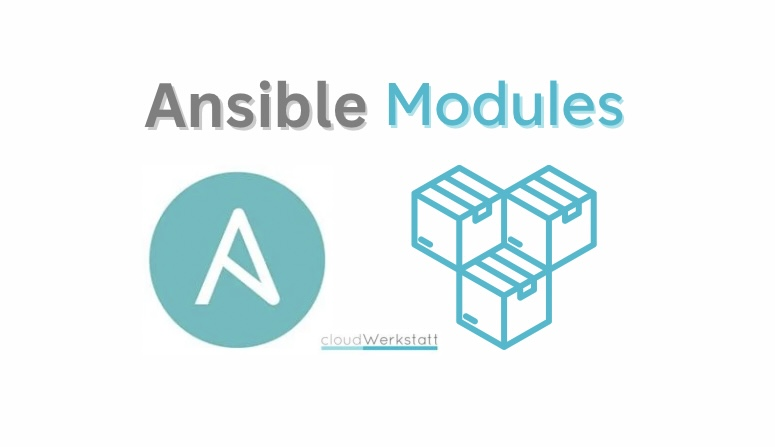

# MODULO PARTED EN ANSIBLE
---

> En esta prueba vamos a crear y redimensionar particiones usando el módulo parted junto al módulo filesystem para ayudarnos.

## Índice
1. [Explicación del módulo parted](intro.md)

2. [Listado del disco y sus particiones](listar.md)

3. [Formateo de 1 disco](formateo.md)

4. [Formateo de 2 discos](formateo2.md)

5. [Redimensionamiento](redimensionar.md)

## Referencias
* [Parted en documentación de Ansible](https://docs.ansible.com/ansible/latest/collections/community/general/parted_module.html)
* [ChatGPT](https://chatgpt.com/)