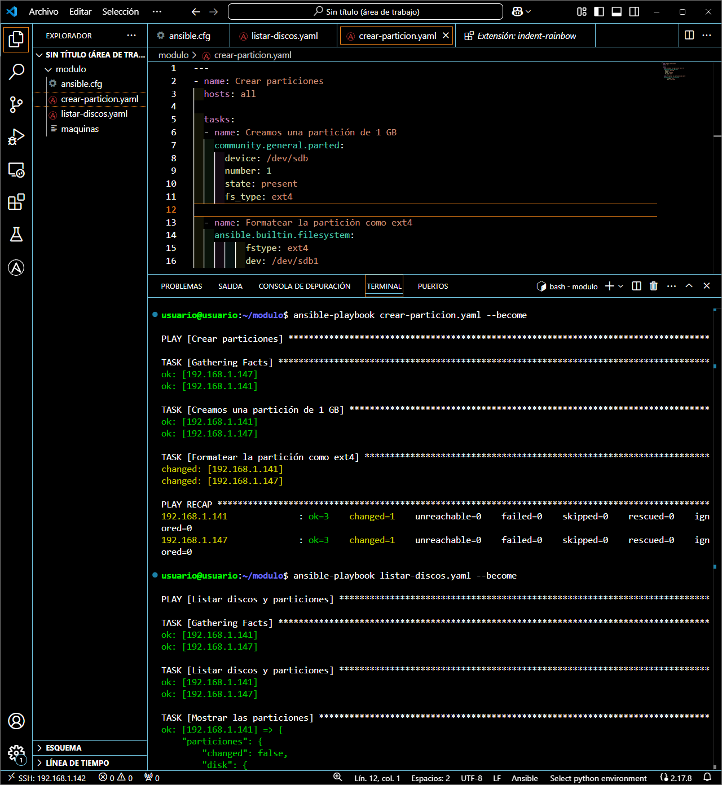

# Creación y formateo de particiones
---
Para que ese disco sea totalmente utilizable debemos crear y formatear la partición

```javascript
---
- name: Crear particiones
  hosts: all
  tasks:

    - name: Crear partición  de 1GB
      community.general.parted:
        device: /dev/sdb
        number: 1
        state: present
        fs_type: ext4

    - name: Formatear la partición como ext4
      ansible.builtin.filesystem:
        fstype: ext4
        dev: /dev/sdb1
```


Como podemos ver, la partición se creará en formato ``ext4`` como hemos definido en ``fs_type`` y será ``sdb1`` porque en la etiqueta ``number`` le hemos puesto el 1.

Después, usando el módulo ``filesystem`` formateamos la partición que hemos creado anteriormente ya que como hemos discho, ``parted`` solo **sirve para crear la partición, no para formatearla**.