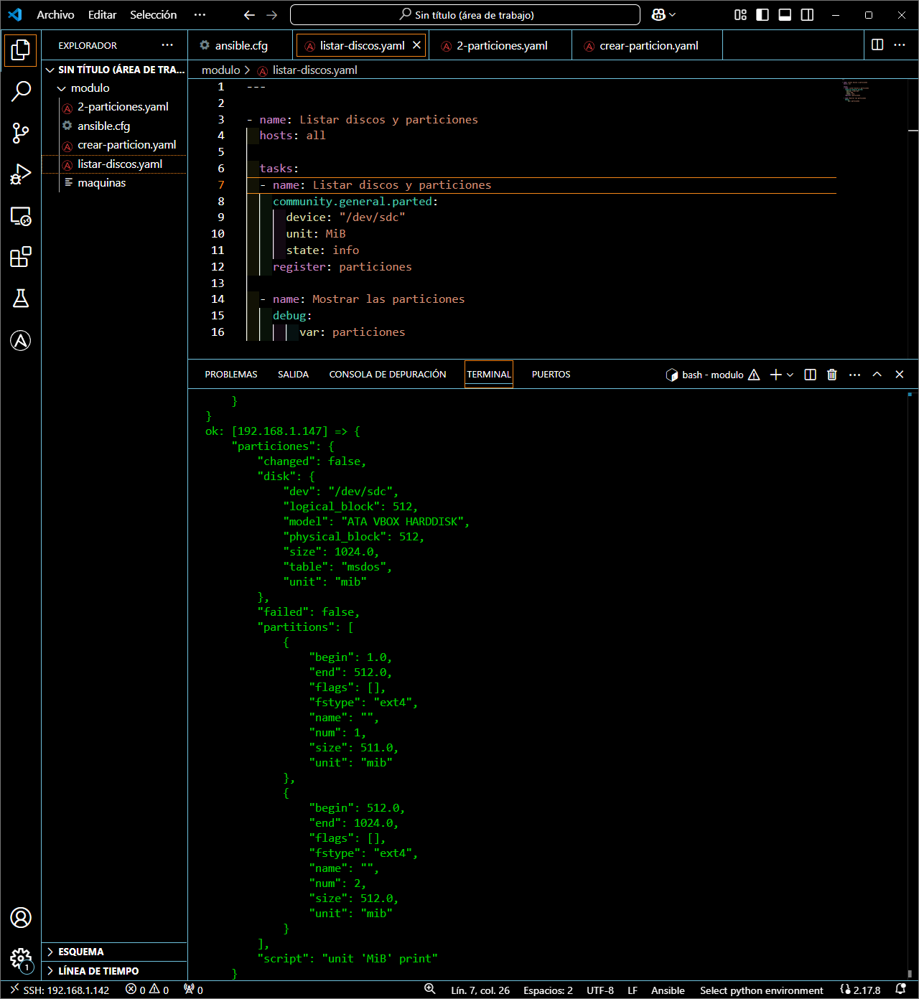

# Formateo de 2 particiones en un disco
---

```javascript
---
- name: Crear 2 particiones
  hosts: all

  tasks:
  - name: Creamos una partición de 500 MB
    community.general.parted:
      device: /dev/sdc
      number: 1
      state: present
      part_start: 0%
      part_end: 50%
      fs_type: ext4

  - name: Creamos otra partición de 500 MB
    community.general.parted:
      device: /dev/sdc
      number: 2
      state: present
      part_start: 50%
      part_end: 100%
      fs_type: ext4

  - name: Formatear la partición como ext4
    ansible.builtin.filesystem:
          fstype: ext4
          dev: /dev/sdc1

  - name: Formatear la otra partición como ext4
    ansible.builtin.filesystem:
          fstype: ext4
          dev: /dev/sdc2
```

> Esa es la tarea para crear y formatear las particiones, pero vamos a probar primero si existe el disco ``sdc``.


> Hemos comprobado que ``sdc`` efectimante existe.

Ahora, en base a la tarea anterior, vamos a crear las particiones y vamos a explicar un poco sus parámetros.


Esta tarea tiene más parámetros de lo normal porque queremos crear varias particiones en un mismo disco, tenemos por ejemplo, ``part_start`` y ``part_end``. Esos parámetros son clave porque define que porcentaje del disco le damos a las particiones, en este caso, como queremos que las 2 particiones usen el total del disco, a una le damos un primer 50% y a la siguiente, del 50% hasta el 100%.

En la parte del módulo ``filesystem`` debemos indicar el ``sdc`` con con el número que le hayamos asignado a las particiones en las etiquetas ``number``. Ahora vamos a listar para ver si se han creado correctmante las dos particiones.


> Como podemos ver, se han creado correctamente.