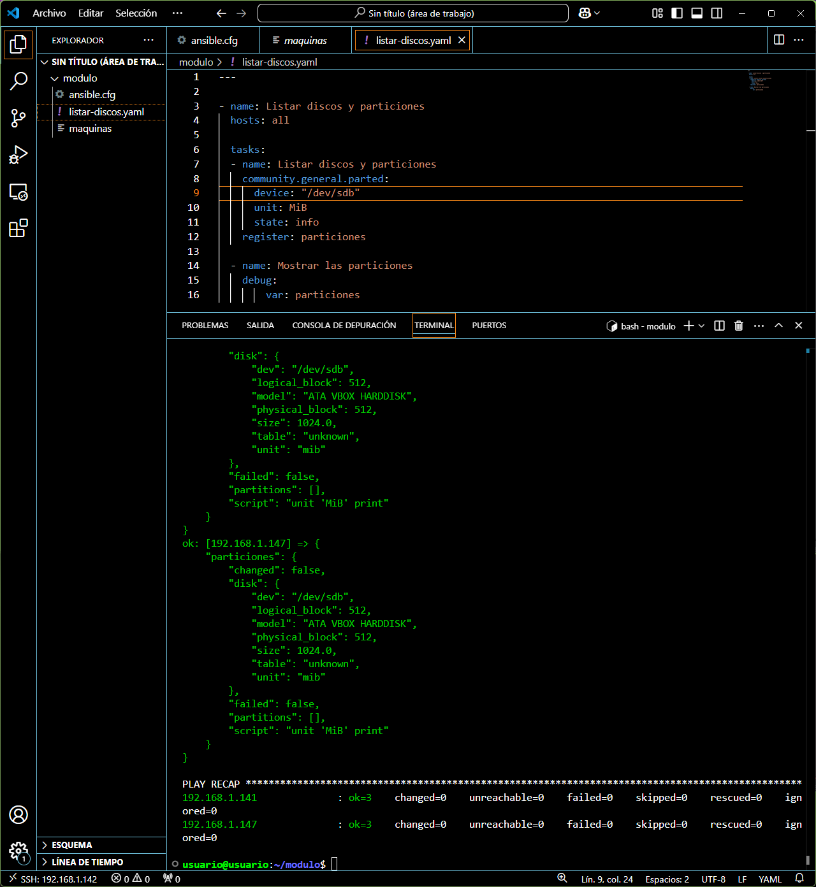

# Listar particiones
---
Listar las particiones de los discos es esencial para ver como se divide, para eso, vamos a usar una tarea bastante simple que nos ayude a listar las particiones **de un disco en específico**

```javascript
---

- name: Listar discos y particiones
  hosts: all

  tasks:
  - name: Listar discos y particiones
    community.general.parted: 
      device: "/dev/sdd"
      unit: MiB
      state: info
    register: particiones

  - name: Mostrar las particiones
    debug:
        var: particiones
```

En esta tarea lo que hacemos es listar el dispositivo ``sdd`` en la unidad ``MiB`` y registramos la salida en una variable llamada ``particiones``.

Después mostramos la salida mediante ``debug`` llamando a la variable ``particiones``.


