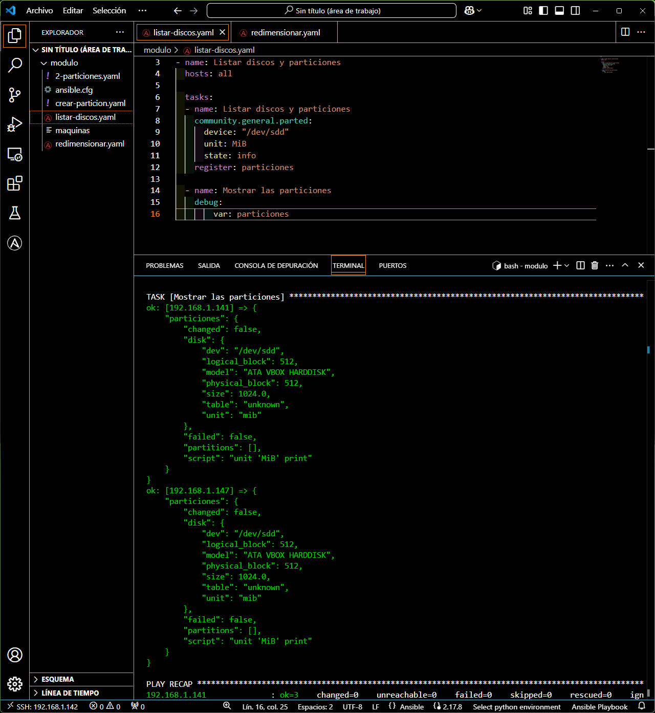

# Redimensionamiento de discos
---
En esta prueba, lo he hecho con un disco formateado con msdos (MBR) y con otro disco con tabla de particiones GPT.

## MBR
Lo malo a la hora de redimensionar discos con tabla de partición MBR es que no lo puedes hacer sin antes eliminarlo, eso es lo que vamos a hacer:

```javascript
---
- name: Redimensionamos
  hosts: all

  tasks:

  - name: Eliminamos la partición
    community.general.parted:
      device: /dev/sdb
      number: 1
      state: absent

  - name: Creamos la partición otra vez
    community.general.parted:
      device: /dev/sdb
      number: 1
      state: present
      part_end: "100%"

  - name: Redimensionar el sistema de archivos ext4
    command:
      resize2fs /dev/sdb1

```


Como podemos ver, después de eliminarlo y volverlo a poner, podemos observar que efectimante se ha redimensionado. Lo bueno de este módulo es usar su etiqueta ``resize``, que aplicaremos en el disco con la tabla de particiones ``GPT``.

## GPT
Como he dicho antes, con MBR no se puede usar la etiqueta ``resize`` y es más incómodo redimensionar y extender un disco, pero con ``GPT``, es un poco menos lioso.

>Hemos insertado un nuevo disco de 1 Gb (sdd)



>Lo formateamos como ``GPT``. El uso de ``part_start`` y ``part_end`` en un principio no es obligatorio, pero si quieres estar seguro, lo puedes poner. Con el comando ``parted /dev/sdd print`` comprobamos que se ha creado correctmante como ``GPT``.

> [!CAUTION]
Es obligatorio el uso de la etiqueta ``label`` porque si no cogerá la tabla por defecto ``(msdos)`` y no se crearía correctmante.


Ahora simplemente extendemos en VirtualBox el disco de 1Gb a 2Gb.


> Se puede observar que el disco tiene un tamaño de 2048 MiB pero la partición solo tiene 1024, usamos la siguiente tarea para expandirlo:

```javascript
---
- name: Redimensionamos la partición GPT
  hosts: all

  tasks:

  - name: Extendemos la partición
    community.general.parted:
      device: /dev/sde
      number: 1
      part_end: "100%"
      resize: true
      state: present
```


> Ahora, la partición tiene 2Gb y podemos ver que si la tabla es ``GPT``, el proceso es bastante más corto y cómodo.
